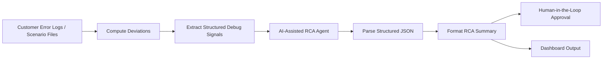

# AUTOSAR Debugging Automation

An AI-assisted debugging workflow for AUTOSAR customer error logs and state-path deviations.

This project automates first-pass debugging analysis by comparing failure scenarios against a known baseline path, identifying the first deviation and last meaningful reached state, generating structured root-cause hypotheses, and producing dashboard-backed RCA summaries with human-in-the-loop review.

---

## Project Highlights

- Automated baseline-vs-failure path comparison
- AI-assisted first-pass RCA generation
- Human-in-the-loop review workflow
- Dashboard-backed debugging summaries
- Designed for AUTOSAR customer error-log triage

---

## Overview

Debugging customer-reported AUTOSAR issues is often repetitive, manual, and time-consuming. Engineers typically need to inspect logs, compare expected vs. actual state transitions, identify where the execution path diverged, and then formulate possible causes and next diagnostic steps.

This workflow reduces that manual effort by automating the early triage phase.

The system:
- ingests customer error scenarios
- compares scenario paths against a baseline
- detects deviations and ErrorHandler branches
- extracts structured debugging signals
- uses an AI agent to generate likely causes and next checks
- formats the output into readable RCA summaries
- supports human approval before further handoff

---

## Problem Statement

In traditional customer-support and debugging flows, engineers often spend significant time on:
- manually reviewing error logs
- comparing baseline vs. failed execution paths
- identifying the first point of divergence
- summarizing findings for developers or stakeholders
- repeating similar RCA steps across multiple tickets

This creates delays in triage and makes debugging effort difficult to scale.

---

## Solution

This project implements an AI-assisted AUTOSAR debugging pipeline that automates first-pass root-cause analysis for scenario-path deviations.

The workflow performs:
1. **Baseline vs. scenario comparison**
2. **Deviation detection**
3. **ErrorHandler path identification**
4. **AI-assisted RCA generation**
5. **Structured summary formatting**
6. **Human-in-the-loop review before final use**

The result is a traceable and reviewable debugging summary that helps engineers triage issues faster and more consistently.

---

## Key Capabilities

- Baseline vs. failure-path comparison
- First-deviation detection
- Last meaningful reached-state extraction
- ErrorHandler path identification
- Structured RCA hypothesis generation
- Suggested next debugging checks
- Dashboard-backed summaries
- Human-in-the-loop review
- GitHub Pages-based visualization output

---

## Workflow Architecture

---

## Future Improvements

- Historical case retrieval using a RAG layer
- Postgres-backed incident memory
- Similar-ticket recommendations
- Resolution learning from confirmed fixes
